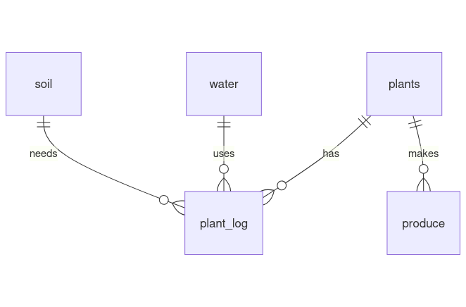

# GrowLog Database

#### By Thomas Abad

## Video overview : <https://youtu.be/UNncKzTVOdc>

## Scope

The GrowLog database is designed to help users track the growth and health of plants, log daily conditions, and record the yield of produce. It provides a structured way to monitor plant growth, the types of water and soil used, and overall plant performance. The scope of the database includes:
- Plants and their statuses (active or inactive).
- Soil types used for growing plants.
- Water types used for irrigation.
- Daily logs of plant conditions (e.g., soil temperature, humidity, light duration, etc.).
- Produce information, including type and yield.

The following aspects are outside the database's scope:
- Any information about users or gardeners.
- External environmental factors like weather conditions.
- Data related to plant growth or produce sales.
- Advanced pest or disease diagnostics.
- More specific data about plants' condition such as types of fertilizers and trace elements.

## Functional Requirements

This database will support:
- Add, update, and delete plants, soil types, and water types.
- Log daily plant conditions, including soil types, and water types.
- View active plants and their logs.
- Record produce yields for each plant.

This version of the database does not predict plant growth or yield based on logged data. Neither does it integrate with external systems like IoT sensors or weather APIs. This database also does not allow user accounts or manage user accounts or permissions.

## Representation

All entities are stored in a MySQL database with the following schema.

### Entities

The database includes the following entities: 
**plants**: Represents individual plants and their statuses. 
**soil**: Represents different types of soil used for growing plants. 
**water**: Represents different types of water used for irrigation. 
**plant_log**: Represents daily logs of plant conditions. 
**produce**: Represents the yield and type of produce from plants. 

#### plants
* `id`, Which gives each plant added to this table with a unique id as an `UNSIGNED` `INT`. This column has the `PRIMARY KEY` constraint applied.
* `name`, Which specifies the plant's name as a `VARCHAR(64)` as it shouldn't be more than a couple words long hence the 64 character limit.
* `status`, Which uses a `ENUM` of `active` or `inactive` if the plant is still alive and being taken care of or dead/no longer being recorded periodically with a `DEFAULT` constraint of `active` when inserting or updating a new plant in this table.

All columns in the plants table are required and have the `NOT NULL` constraint applied to each as well.
#### soil
* `id`, Which gives each soil a unique id as an `UNSIGNED` `INT`. This column has the `PRIMARY KEY` constraint applied.
* `name`, which specifies the name of the soil or soil mix as a `VARCHAR(32)` as it would only be a couple words long hence the 32 character limit, this column also has the `UNIQUE` constraint applied to prevent repeat names/soil types in the table.

All columns in the soil table are required and have the `NOT NULL` constraint applied.
#### water
* `id`, Which gives each type of water a unique id as an `UNSIGNED` `INT`. This column has the `PRIMARY KEY` constraint applied.
* `type`, Which specifies the type of water using a `ENUM` with the following values:
`Tap Water`, `Well Water`, `Mineral Water`, `Spring Water`, `Distilled Water`, `Alkaline Water`, `Purified Water`.

All columns in the water table are required and have the `NOT NULL` constraint applied.
#### plant_log
* `id`, Which gives each log a unique id as an `UNSIGNED` `INT`. This column has the `PRIMARY KEY` constraint applied.
* `datetime`, Which specifies the date and time of the log entry which is recorded as  `DATETIME`. This column has the `DEFAULT` constraint applied with the value of `CURRENT_TIMESTAMP` if no value is provided when inserting the entry to this table.
* `plant_id`, Which references the `plants` table id column in order to know which plant this entry is referring to. Thus this column is a `UNSIGNED` `INT` and has the `FOREIGN KEY` constraint applied.
* `soil_id`, Which references the soil table's id column in order to record which kind of soil is being used in this log entry, Thus this column is a `UNSIGNED` `INT` and has the `FOREIGN KEY` constraint applied.
* `water_id`, Which references the water table's id column in order to record which type of water is being used in this log entry, Thus this column is a `UNSIGNED` `INT` and has the `FOREIGN KEY` constraint applied.
* `water_amount`, Which records the amount of water received as a `DECIMAL(8,2)`, this column is measured in milliliters.
* `soil_temperature`, Which records the soil temperature as a `DECIMAL(5,2)`, this column is measured in Celsius.
* `humidity`, Which records the relative humidity as a `TINYINT`, measured in percentages.
* `light_duration`, Which records the duration of light the plant received as  `TIME`, measured in hours.
* `soil_pH`, Which records the pH of the soil as a `DECIMAL(3,1)`, measured using a decimal value.
* `moisture_level`, Which records the moisture level of the soil as a `TINYINT`, measured in percentages.
* `electrical_conductivity`, Which records the electrical conductivity of the soil as a `DECIMAL(3,1)`, measured in millisiemens per centimeter `(mS/cm)`.
* `nitrogen_level`, Which records the nitrogen level in the soil as a `DECIMAL(3,1)`, measured in percentages.
* `phosphorus_level`, Which records the phosphorus level in the soil as a `DECIMAL(3,1)`, measured in percentages.
* `potassium_level`, Which records the potassium level in the soil as a `DECIMAL(3,1)`, measured in percentages.
* `calcium_level`, Which records the calcium level in the soil as a `DECIMAL(3,1)`, measured in percentages.
* `magnesium_level`, Which records the magnesium level in the soil as a `DECIMAL(3,1)`, measured in percentages.
* `leaf_color`, Which records the overall leaf color of the plant as a `VARCHAR(32)` as only a couple words would be used to describe the leaf color.
* `height`, Which records the height of the plant as a `MEDIUMINT` as this will be measured and stored in centimeters.
* `stem_thickness`, Which records the thickness of the stem as a `DECIMAL(4,1)` since this will be measured and stored in millimeters.
* `stage`, Which records the current stage of the plant as an `ENUM` with the following possible values: `Germination`, `Seedling`, `Vegetative`, `Transition`, `Flowering`, `Fruiting`, `Ripening`, `Senescence`, `Dormancy`, and `Post-Harvest`.
* `pests`, Which records any signs of pests as a `VARCHAR(64)` as only a couple words would be used to describe any pests or signs of pests, The `DEFAULT` constraint is added to this column with a value of `'None'` if no data is provided in this column when inserting the log entry to this table.
* `signs_of_disease`, Which records any signs of disease as a `VARCHAR(64)` as only a couple words would be used to describe any signs of disease, The `DEFAULT` constraint is added to this column with a value of `'None'` if no data is provided in this column when inserting the log entry to this table.
* `general_condition`, Which records the general condition of the plant as `TEXT` since this would be minimum a sentence and maximum a couple sentences long. 
* `notes`, Which records any extra notes as `TEXT` that should be added to this log entry.

The `id`, `datetime`, `plant_id`, `soil_id`, `water_id`, `stage`, and `general_condition` columns have the `NOT NULL` constraint applied to them as they are either necessary or crucial information the log entry should contain.
#### produce
* `id`, Which gives each entry a unique id as an `UNSIGNED` `INT`. This column has the `PRIMARY KEY` constraint applied.
* `date`, Which specifies the date and time of the entry as `DATETIME`. This column has the `DEFAULT` constraint applied with the value of `CURRENT_TIMESTAMP` if no value is provided when inserting the entry to this table.
* `plant_id`, Which references the plants table's id column in order to know which plant this entry is referring to. Thus this column is a `UNSIGNED` `INT` and has the `FOREIGN KEY` constraint applied.
* `type`, Which records the type of produce this is using a `VARCHAR(64)` as it should only be one or two words.
* `total_yield`, which records the total weight of the produce as an `UNSIGNED` `MEDIUMINT`, stored in grams.

All columns in the produce table are required and have the `NOT NULL` constraint applied.

### Relationships

The below entity relationship diagram describes the relationships among the entities in the database.

As detailed in the diagram:
- **plants ↔ plant_log**: One plant is capable of having 0 to many logs in the plant_log table. 0, if the plant has yet to be logged in the plant_log table but has been added to the plants table, And many if the plant has been logged multiple times in the plant_log table. A log can reference only one plant, as a single log entry cannot apply to multiple plants.

- **soil ↔ plant_log**: A soil type can be used in 0 to many logs in the plant_log table. 0, if the soil type has not been referenced at all in any entry, And many if the soil type is used in multiple entry logs. A log entry can reference only one soil type, as a single log cannot include multiple soil types.

- **water ↔ plant_log**: A water type can be used in 0 to many logs in the plant_log table. 0, if the type of water has not been referenced in any entry, and many if it appears in multiple log entries. A log entry can reference only one type of water, as a single log cannot include multiple water types.

- **plants ↔ produce**: One plant is capable of having 0 to many entries in the produce table. 0, if the plant has yet have made any produce and logged in the produce table, And many if the plant has multiple entries in the produce table. An entry can reference one and only one plant as you cannot have a singular entry in the produce table for more than one plant.

## Optimizations

- **Indexes**:
  * Users frequently access all logs for a particular plant ID. Therefore, The `plant_log_ids` index is created for `id` and `plant_id` columns for the `plant_log` table to optimize lookup time.

  * When trying to find out the id, status or name of a plant users will need to know either the id or name of the plant and search for it before they can use that information elsewhere, The `plant_name_status` index was created to optimize search on the `id`, `name` and `status` on the `plants` column.

  * Users of the database frequently like to access all logs for a particular plant id. Therefore, the `produce_ids` index was created for the `id` and `plant_id` columns for the `produce` table to optimize lookup time.

  * When looking up a type of water to use in the `plant_log` table you must first query the `water` table to find the desired information, The `water_types` index created for the `id` and `type` columns for the `water` table to optimize lookup time.

  * When looking up a type of soil to use in the `plant_log` table you must first query the `soil` table to find the desired information, The `soil_names` index created for the `id` and `name` columns for the `soil` table to optimize lookup time.

- **Views**:
  - `active_plant_log`: Provides a consolidated view of all active plants and their logs.
  * The `active_plant_log` view combines both the `plants` table and `plant_log` table but only for plants with the `status` `'active'`. This makes one virtual table with all active plants and their logs in one consolidated package.

  * The `plants_produce` view combines the `plants` and `produce` tables, displaying only plants with associated produce logs. Therefore you now have a virtual table with the plant name, plant_id, status, produce_id, date, type, and total_yield.

These optimizations improve query performance and simplify data retrieval for common use cases.

## Limitations

The GrowLog database does not have user accounts and does not include detailed user or gardener information, as it focuses solely on plant-related data.

It assumes that all water types are predefined and does not dynamically adapt to new types or allow adding more attributes or columns to record specific data without schema changes.

The GrowLog database cannot represent complex relationships between environmental factors and plant growth, nor can it perform advanced analytics or predictions based on logged data.